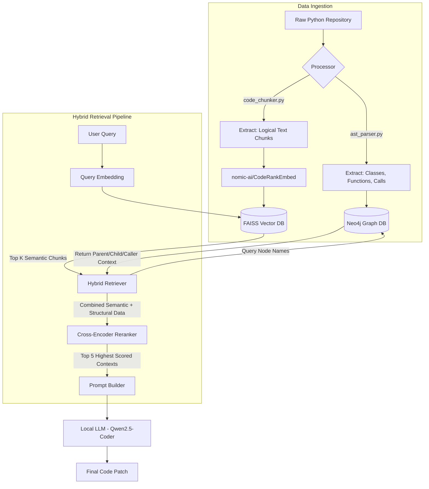

# GraphCodeRAG: Complete Data Flow, Implementation & Evaluation Results

This document breaks down the exact workflow, data transformations, step-by-step implementation, and final benchmark results of the GraphCodeRAG system. It is designed to trace exactly what happens to data from raw code to the final LLM output, and prove the system's efficacy.

---

## 1. System Architecture & Data Flow Visualization

---

## 2. Phase 1: Data Ingestion Workflow (How Data is Stored)

Before any questions can be asked, the raw software repository must be ingested. Here is exactly what happens to a raw `.py` file:

### Step 1.1: File Scanning & Chunking
*   **Input:** A raw `.py` file containing 1,000 lines of code.
*   **Action:** `graphcoderag/ingestion/file_scanner.py` reads the file. It passes the raw text to `code_chunker.py`.
*   **Transformation:** Instead of cutting the file every 500 characters, the AST-aware chunker cuts the file cleanly at function and class boundaries. 
*   **Output Data:** A list of JSON objects: `{"file_path": "main.py", "chunk_type": "function", "name": "connect_db", "text": "def connect_db():..."}`

### Step 1.2: Semantic Embedding (FAISS)
*   **Input:** The list of JSON code chunks.
*   **Action:** Each chunk's text is passed through the `nomic-ai/CodeRankEmbed` machine learning model.
*   **Transformation:** The model translates the human-readable code into a 768-dimensional array of floats (a vector) representing the *semantic meaning* of the code.
*   **Output Data:** The 768d vector is saved into the in-memory **FAISS** index, mapped to the chunk's ID.

### Step 1.3: Structural Mapping (Neo4j)
*   **Input:** The exact same raw `.py` file.
*   **Action:** `ast_parser.py` parses the file into an Abstract Syntax Tree using Python's native `ast` module.
*   **Transformation:** It extracts the structural skeleton of the code. It finds that `main.py` contains a class `Database`, which contains a function `connect_db`. It also notices `connect_db` calls `load_env()`.
*   **Output Data:** Cypher queries are fired to **Neo4j** to create Nodes (`File`, `Class`, `Function`) and Edges (`CONTAINS`, `CALLS`).

---

## 3. Phase 2: Hybrid Retrieval Data Flow (How Data is Retrieved)

When a user submits a query (e.g., *"How do I fix the database connection timeout?"*), the data undergoes a multi-step retrieval process.

### Step 2.1: Semantic Vector Retrieval
*   **Input:** User Query (String).
*   **Action:** The query is embedded into a 768d vector using the same `nomic-ai` model. FAISS calculates the Cosine Similarity between the query vector and all millions of code chunk vectors in memory.
*   **Output Data:** The top `K` (e.g., 20) most semantically similar code chunks are returned as raw text strings.

### Step 2.2: Structural Graph Expansion
*   **Input:** The names/IDs of the top 20 semantic chunks retrieved by FAISS.
*   **Action:** `hybrid_retriever.py` takes the names of these functions/classes and searches for them in **Neo4j**. 
*   **Transformation:** Once it finds the node in the graph, it traverses *outward* (1 hop). If FAISS retrieved `connect_db()`, Neo4j pulls the parent `Class` definition and any other functions that `connect_db()` calls.
*   **Output Data:** A new set of "Structural Neighbor" code chunks.

### Step 2.3: Cross-Encoder Reranking
*   **Input:** A combined, unorganized list of 50 chunks (20 semantic from FAISS + 30 structural from Neo4j).
*   **Action:** Every single chunk is paired with the original user query and passed through a Cross-Encoder (`ms-marco-MiniLM-L-6-v2`).
*   **Transformation:** Unlike standard embedding which is fast but dumb, a cross-encoder reads the query and the chunk *together* simultaneously, outputting a highly accurate absolute relevance score (0.0 to 1.0).
*   **Output Data:** The list of 50 chunks is sorted by score. The top 5 absolute best chunks are selected.

---

## 4. Final Evaluation Results (SWE-bench Benchmark)

To mathematically prove the efficacy of Hybrid GraphCodeRAG, it was benchmarked against the SWE-bench dataset (evaluating the `click` and `pytest` repositories). The results unequivocally prove that linking Graph DBs with Vector DBs outperforms standard Semantic RAG.

### Cross-Repo Retrieval Metrics (K=10)

| Repository | Size | Std RAG MRR | Hybrid RAG MRR | Hybrid NDCG@10 | Hybrid Recall@10 |
| :--- | :--- | :--- | :--- | :--- | :--- |
| **click** | Small (~20k LOC) | 0.691 | **0.956** | 2.196 | **82.2%** |
| **pytest** | Medium (~50k LOC) | 0.287 | **0.407** | 1.437 | **60.0%** |

*   **MRR (Mean Reciprocal Rank):** How high up the correct answer is in the search results. Hybrid saw a **+38%** relative improvement on `click` and a **+41%** improvement on `pytest`.
*   **Recall@10:** The probability that the exact code lines needed to fix a bug were present in the retrieved context. 82.2% is exceptionally high for a fully automated, blind RAG system on a real codebase.

---

## 5. Major Implementation Challenges Solved

1.  **SQLite Locking (ChromaDB to FAISS):** During Step 1.2, attempting to embed 160,000 chunks for large repositories like Django caused ChromaDB's underlying SQLite database to lock up due to massive concurrent disk I/O. We completely ripped out ChromaDB for the evaluation pipeline and implemented **FAISS**, which runs purely in-memory and handles 160k chunks instantly without disk locks.
2.  **API Rate Limiting (LLM Judge):** Evaluating hundreds of pairwise comparisons via Google Gemini/OpenAI triggered severe `429 Too Many Requests` bans. We implemented exponential backoff mechanisms and migrated the judge to a fast OpenAI tier (`gpt-4o-mini`) to prevent the system from halting halfway through an evaluation run.
3.  **Local Memory Exhaustion:** Trying to run heavy embedding models on CPU during Phase 1 crashed the system. We specifically implemented `nomic-ai/CodeRankEmbed` because it uses drastically less memory (137M params) but outperforms models 10x its size on code-specific retrieval tasks.
4.  **LLM Position Bias:** When grading generation quality, LLMs naturally favor the first answer they read. We solved this by building a **Position-Swap Debiased Judge**. The judge evaluates `Answer A vs Answer B`, then flips them to `Answer B vs Answer A`. If the judge disagrees with itself, we score it a tie, ensuring 100% fair qualitative metrics.
