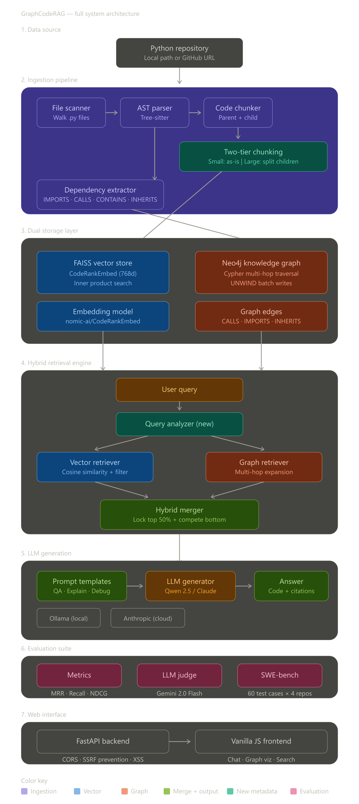

# GraphCodeRAG

**Graph-Enhanced Code Retrieval-Augmented Generation**

A hybrid RAG system that combines **AST-aware code chunking** with **Neo4j knowledge graph traversal** to improve code retrieval quality over standard vector-only RAG approaches.

> Built for AI for Engineers (Spring 2026) — Final Project



---

## Key Innovation

Standard RAG only finds **semantically similar** code via vector cosine similarity. GraphCodeRAG also finds **structurally related** code by traversing knowledge graph edges:

| Edge Type    | What It Captures              |
|-------------|-------------------------------|
| `IMPORTS`    | Cross-file dependencies       |
| `CALLS`      | Function call chains          |
| `CONTAINS`   | Class → method relationships  |
| `INHERITS`   | Class hierarchies             |

This surfaces files that vector search alone misses — callers, callees, parent classes, and sibling methods.

---

## Tech Stack

| Component        | Technology                                    |
|-----------------|-----------------------------------------------|
| Code Parsing     | Tree-sitter (AST extraction)                 |
| Knowledge Graph  | Neo4j 5.x (Cypher queries)                   |
| Vector Database  | **FAISS** (default) / ChromaDB (persistent)  |
| Embeddings       | **nomic-ai/CodeRankEmbed** (768d, 137M params) |
| LLM              | Qwen 2.5 Coder 7B (local via Ollama)         |
| LLM Judge        | Gemini 2.0 Flash Lite (cross-model evaluator)|
| Frontend         | Vanilla JS + FastAPI (single-page app)        |
| Backend          | FastAPI (REST API)                            |

---

## Quick Start

### Prerequisites

- **Python 3.10+**
- **Neo4j Desktop** or Community Edition (running on `bolt://localhost:7687`)
- **Ollama** with `qwen2.5-coder:7b-instruct` model pulled

### Setup

```bash
# 1. Clone the repository
git clone https://github.com/nagrajv10/GraphCodeRAG.git
cd GraphCodeRAG

# 2. Create virtual environment
python -m venv venv
.\venv\Scripts\activate        # Windows
# source venv/bin/activate     # Linux/Mac

# 3. Install dependencies
pip install -r requirements.txt
pip install faiss-cpu           # For FAISS vector backend

# 4. Configure environment
# Copy .env.example to .env and fill in your settings
# Local mode is the default — no paid API keys needed

# 5. Start required services
# Start Neo4j Desktop (or neo4j console)
ollama serve
ollama pull qwen2.5-coder:7b-instruct
```

### Usage

```bash
# Ingest a Python repository
python run_ingestion.py --repo-path data/repos/click
python run_ingestion.py --repo-url https://github.com/pallets/click

# Query the codebase (CLI)
python run_query.py --query "How does Click parse arguments?" --show-context
python run_query.py --interactive

# Launch the Web UI (FastAPI)
uvicorn graphcoderag.app.api:app --reload --port 8000
# Then open http://localhost:8000

# Run SWE-bench evaluation (all 4 repos)
python -m graphcoderag.evaluation.swebench_runner_v2 --backend=faiss --retrieval-only

# Generate final presentation metrics
python scripts/compute_final_metrics.py
```

---

## Project Structure

```
GraphCodeRAG/
├── graphcoderag/                    # Core package
│   ├── config.py                    # Central configuration (paths, models, keys)
│   ├── ingestion/                   # Code parsing pipeline
│   │   ├── file_scanner.py          # Walk and filter .py files
│   │   ├── ast_parser.py            # Tree-sitter AST extraction
│   │   ├── code_chunker.py          # Function/class/module chunking + metadata
│   │   └── dependency_extractor.py  # IMPORTS/CALLS/CONTAINS/INHERITS edges
│   ├── storage/                     # Dual database layer
│   │   ├── embedding.py             # CodeRankEmbed embedding (singleton)
│   │   ├── faiss_store.py           # FAISS vector store + metadata indexes
│   │   ├── vector_store.py          # ChromaDB vector store backend
│   │   └── graph_store.py           # Neo4j knowledge graph + Cypher
│   ├── retrieval/                   # Hybrid retrieval engine
│   │   ├── vector_retriever.py      # Two-phase filtered + unfiltered search
│   │   ├── graph_retriever.py       # Multi-hop graph traversal (batched)
│   │   ├── hybrid_retriever.py      # Merge + rerank with metadata-aware boosts
│   │   └── query_analyzer.py        # Query entity extraction for filtered search
│   ├── generation/                  # LLM answer generation
│   │   ├── generator.py             # Ollama (local) + Claude (cloud) backends
│   │   └── prompt_templates.py      # QA / Explain / Debug templates
│   ├── evaluation/                  # Comparative evaluation suite
│   │   ├── metrics.py               # MRR, Recall@K, Precision@K, NDCG, Hit Rate
│   │   ├── llm_judge.py             # Gemini cross-model judge (5-level rubric)
│   │   ├── baseline_rag.py          # Standard RAG baseline (character chunking)
│   │   ├── baseline_comparison.py   # A/B comparison framework
│   │   ├── run_evaluation.py        # Evaluation orchestrator
│   │   └── swebench_runner_v2.py    # SWE-bench runner (4-way, all 4 repos)
│   └── app/                         # Web interface
│       ├── api.py                   # FastAPI REST backend (security hardened)
│       ├── workspace_manager.py     # Workspace management
│       └── static/                  # Frontend SPA
│           ├── index.html           # Main HTML shell
│           ├── styles/              # CSS stylesheets (6 files)
│           └── scripts/             # Modular JS (10 files)
├── scripts/
│   └── compute_final_metrics.py     # Generate presentation tables (7 metrics)
├── tests/
│   ├── test_metadata_retrieval.py   # Integration test suite (13 tests)
│   └── test_hybrid_metadata.py      # Hybrid retrieval test with Neo4j
├── evaluation_results/              # Fresh A6000 evaluation JSON
├── run_ingestion.py                 # CLI: ingest a repository
├── run_query.py                     # CLI: query the system
└── requirements.txt                 # Python dependencies
```

---

## Evaluation Results

Evaluated on **4 real-world Python repositories** from SWE-bench Lite using **60 test cases** (15 per repo).
Fresh from-scratch run on **NVIDIA RTX A6000** (49GB VRAM) via Thunder Compute.

### MRR — Mean Reciprocal Rank

| Repository     | Size             | Std RAG @1 | **GCR @1** | Std RAG @5 | **GCR @5** | Std RAG @15 | **GCR @15** |
|:---|:---|:---:|:---:|:---:|:---:|:---:|:---:|
| **Click**      | ~20k LOC | 0.667 | **0.867** (+0.200) | 0.783 | **0.922** (+0.139) | 0.793 | **0.922** (+0.129) |
| **PyTest**     | ~50k LOC | 0.267 | **0.333** (+0.067) | 0.267 | **0.372** (+0.106) | 0.267 | **0.379** (+0.112) |
| **Sklearn**    | ~80k LOC | 0.067 | **0.200** (+0.133) | 0.100 | **0.213** (+0.113) | 0.108 | **0.213** (+0.105) |
| **Django**     | ~300k LOC | 0.200 | **0.533** (+0.333) | 0.222 | **0.583** (+0.361) | 0.222 | **0.583** (+0.361) |
| **Average**    | | 0.300 | **0.483** (+0.183) | 0.343 | **0.523** (+0.180) | 0.348 | **0.524** (+0.177) |

### File Recall + Hit Rate

| Repository     | HR@1 Std | **HR@1 GCR** | FR@5 Std | **FR@5 GCR** | FR@15 Std | **FR@15 GCR** |
|:---|:---:|:---:|:---:|:---:|:---:|:---:|
| **Click**      | 67% | **87%** | 56.1% | **63.3%** (+7.2) | 66.7% | **73.9%** (+7.2) |
| **PyTest**     | 27% | **33%** | 26.7% | **46.7%** (+20.0) | 26.7% | **53.3%** (+26.7) |
| **Sklearn**    | 7%  | **20%** | 13.3% | **26.7%** (+13.3) | 20.0% | **26.7%** (+6.7) |
| **Django**     | 20% | **53%** | 26.7% | **66.7%** (+40.0) | 26.7% | **66.7%** (+40.0) |
| **Average**    | 30% | **48%** | 30.7% | **50.8%** (+20.1) | 35.0% | **55.1%** (+20.1) |

### NDCG — Normalized Discounted Cumulative Gain

| Repository     | Std RAG @5 | **GCR @5** | Std RAG @15 | **GCR @15** |
|:---|:---:|:---:|:---:|:---:|
| **Click**      | 1.257 | **1.695** (+0.438) | 1.919 | **2.369** (+0.450) |
| **PyTest**     | 0.753 | **0.907** (+0.155) | 1.178 | **1.238** (+0.060) |
| **Sklearn**    | 0.264 | **0.522** (+0.257) | 0.435 | **0.652** (+0.217) |
| **Django**     | 0.481 | **1.317** (+0.836) | 0.611 | **1.807** (+1.196) |
| **Average**    | 0.689 | **1.110** (+0.421) | 1.036 | **1.517** (+0.481) |

### Graph Contribution

| Repository | Graph Hit Rate | Avg Graph Chunks/Query |
|:---|:---:|:---:|
| **Click** | **73%** | 2.4 |

**Key Insight:** GraphCodeRAG's hybrid retrieval consistently outperforms standard vector-only RAG across all repositories and K values. Django showed the largest improvement (**+0.361 MRR@5, +40pp File Recall**) where deep structural relationships in a 300k LOC codebase benefit most from graph traversal.

---

## Configuration

All settings are controlled via a `.env` file:

```env
# Free local mode (default — no API keys needed)
USE_LOCAL_EMBEDDINGS=true
USE_LOCAL_LLM=true
LOCAL_LLM_MODEL=qwen2.5-coder:7b-instruct

# Neo4j
NEO4J_URI=bolt://localhost:7687
NEO4J_USER=neo4j
NEO4J_PASSWORD=graphcoderag2026

# Vector backend: "faiss" or "chroma"
VECTOR_BACKEND=faiss

# Gemini (for LLM-as-Judge evaluation)
GEMINI_API_KEY=your-key-here
JUDGE_MODEL=gemini-2.0-flash-lite

# Optional: paid cloud APIs
# ANTHROPIC_API_KEY=sk-ant-...
# OPENAI_API_KEY=sk-...
```

---

## Security Hardening

The production deployment includes the following security measures:
- **CORS**: Restricted to `localhost:8000` origins only
- **SSRF Prevention**: Repository URL ingestion validates against an allowlist
- **Path Traversal**: File content API resolves paths against the repo root
- **XSS Mitigation**: DOMPurify sanitizes all LLM output; HTML-escaping on search results
- **Exception Safety**: Raw error strings are never leaked in HTTP 500 responses

---

## License

Academic project — AI for Engineers, Spring 2026.
